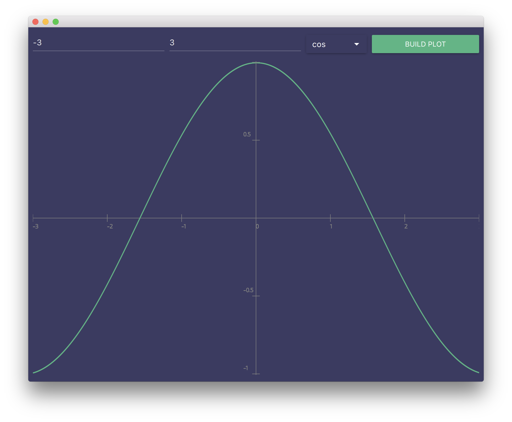
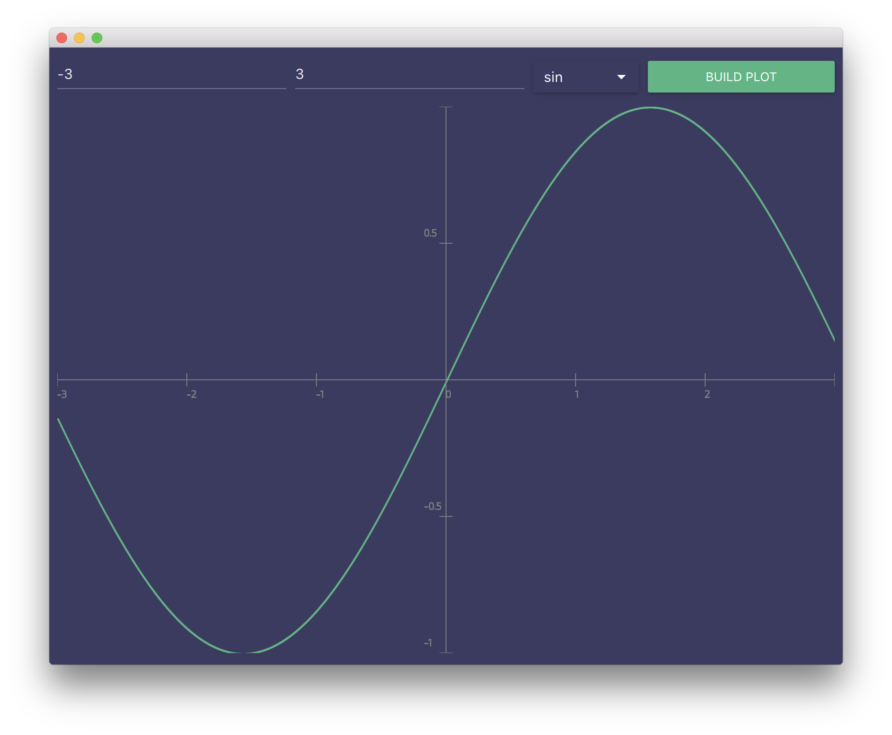
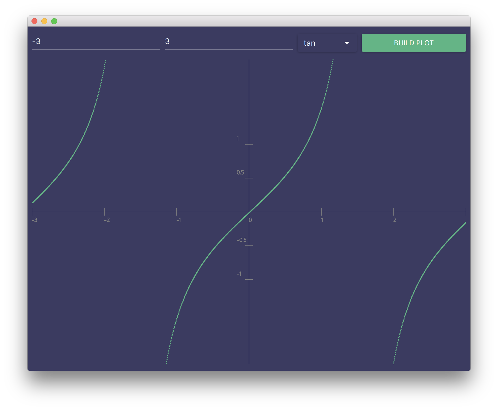
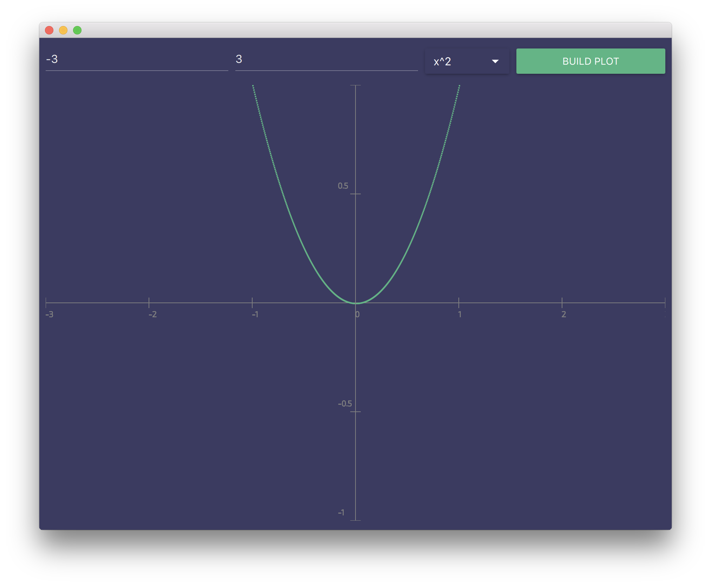

# Plot builder
Some of the plots:

## Cos



## Sin



## tan


## x^2


# How to run
You can install requirements with:
```
pip3 install -U -r requirements.txt
```
And run:
```
python3 main.py
```